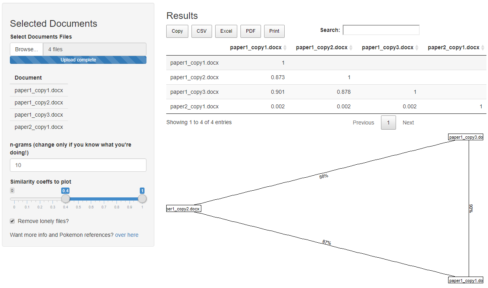

```{r setup, include=FALSE}
knitr::opts_chunk$set(
  echo = TRUE
  , fig.path = "/man/figures/"
)
options(knitr.kable.NA = '', digits = 3)
library(ggplot2)
theme_set(theme_void())
```

<!-- README.md is generated from README.Rmd. Please edit that file -->

# cheatR: Catch 'em baddies 

This is a mini package to help you find cheaters by comparing hand-ins!  
([Read more](https://shouldbewriting.netlify.app/posts/2018-07-29-cheatr/) about the circumstances that brought about the development of this package.)

## Download and Install

[](https://cran.r-project.org/package=cheatR)
[](https://cran.r-project.org/package=cheatR)

You can install `cheatR` with:

```{r, eval=FALSE}
install.packages("cheatR")
```

Or get the dev version from [github](https://github.com/mattansb/cheatR):

```{r, eval=FALSE}
# install.packages("remotes")
remotes::install_github("mattansb/cheatR")
```

See the [*using `cheatR`*](https://mattansb.github.io/cheatR/articles/using-cheatR.html) vignette, or use the accompanying `Shiny` app that can either be run locally 

```{r, eval=FALSE}
cheatR::catch_em_app()
```

Or can be found on [shinyapps.io](https://almogsi.shinyapps.io/cheatR/)!



## Limitations?
  
  - As far as we can tell, this should work on any language; we tried both English and Hebrew, with and without setting `Sys.setlocale("LC_ALL", "Hebrew")`.  
  - Best performance was achieved on `R` version > 3.5.0.

## Authors

  - **Mattan S. Ben-Shachar** [aut, cre].
  - **Almog Simchon** [aut, cre].
