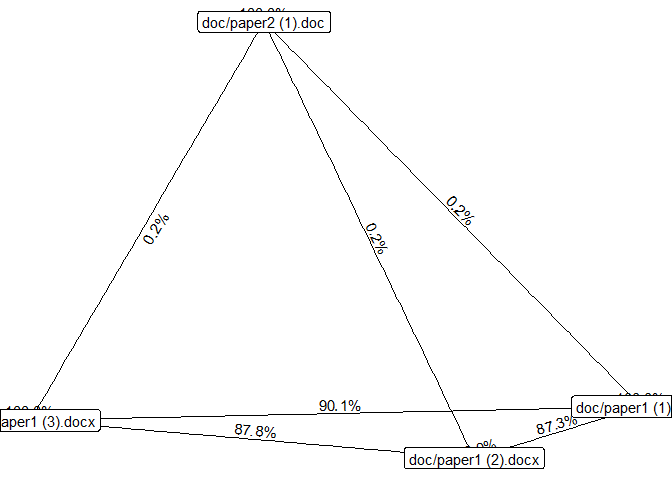

<!-- README.md is generated from README.Rmd. Please edit that file -->
cheatR: Catch 'em baddies 
================================================================================================

This is a mini package to help you find cheaters by comparing hand-ins!
([Read more](https://mattansb.blogspot.com/2018/07/cheatr-r-package-for-catching-cheaters.html) about circumstances that brought about the development of this package.)

Download and Install
--------------------

You can install `cheatR` from [github](https://github.com/mattansb/cheatR) with:

``` r
# install.packages("devtools")
devtools::install_github("mattansb/cheatR")
```

Example use
-----------

### In R console

Create a list of files:

``` r
my_files <- list.files(path = 'doc', pattern = '.doc', full.names = T)
my_files
```

    ## [1] "doc/paper1 (1).docx" "doc/paper1 (2).docx" "doc/paper1 (3).docx"
    ## [4] "doc/paper2 (1).doc"

The first 3 documents are different drafts of the same paper, so we would expect them to be similar to each other. The last document is a draft of a different paper, so it should be dissimilar to the first 3. **All files are about 45K words long.**

Now we can use `cheatR` to find duplicates.

The only function, `catch_em`, takes the following input arguments:

-   `flist` - a list of documents (`.doc`/`.docx`/`.pdf`). A full/relative path must be provided.
-   `n_grams` - see [`ngram` package](https://github.com/wrathematics/ngram).
-   `time_lim` - max time in seconds for each comparison (we found that some corrupt files run forever and crash R, so a time limit might be needed).

``` r
library(cheatR)
```

    ## Catch 'em cheaters!

``` r
results <- catch_em(flist = my_files,
                    n_grams = 10, time_lim = 1) # defults
```

    ## Reading documents... Done!
    ## Looking for cheaters
    ## ===========================================================================
    ## Busted!

The resulting list contains a matrix with the similarity values between each pair of documents:

``` r
knitr::kable(results$results)
```

|                     |  doc/paper1 (1).docx|  doc/paper1 (2).docx|  doc/paper1 (3).docx|  doc/paper2 (1).doc|
|---------------------|--------------------:|--------------------:|--------------------:|-------------------:|
| doc/paper1 (1).docx |                1.000|                     |                     |                    |
| doc/paper1 (2).docx |                0.873|                1.000|                     |                    |
| doc/paper1 (3).docx |                0.901|                0.878|                1.000|                    |
| doc/paper2 (1).doc  |                0.002|                0.002|                0.002|                   1|

You can also plot the relational graph if you'd like to get a more clear picture of who copied from who.

``` r
library(tidygraph)
library(ggraph)

results_graph <- as_tbl_graph(results$results) %>% 
  activate(what = edges) %>%
  filter(!is.na(weight))

ggraph(results_graph) +
  geom_edge_fan(aes(label = round(weight,2)),
                 angle_calc = 'along',
                label_dodge = unit(2.5, 'mm')) +
  geom_node_label(aes(label = name))
```



### Shiny app!

The accompanying `Shiny` app can be found on [shinyapps.io](https://almogsi.shinyapps.io/cheatR/), but can also be run locally with:

``` r
cheatR::catch_em_app()
```


Limitations?
------------

-   As far as we can tell, this should work on any language; we tried both English and Hebrew, with and without setting `Sys.setlocale("LC_ALL", "Hebrew")`.
-   Best performance was achieved on `R` version &gt; 3.5.0.

Authors
-------

-   **Mattan S. Ben-Shachar** \[aut, cre\].
-   **Almog Simchon** \[aut, cre\].
